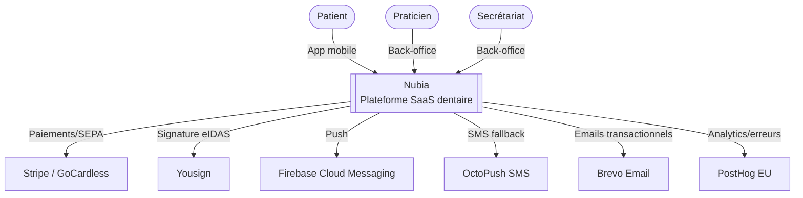
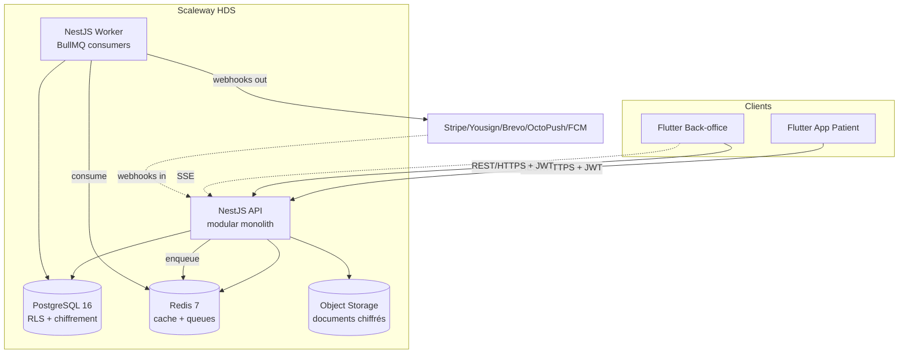
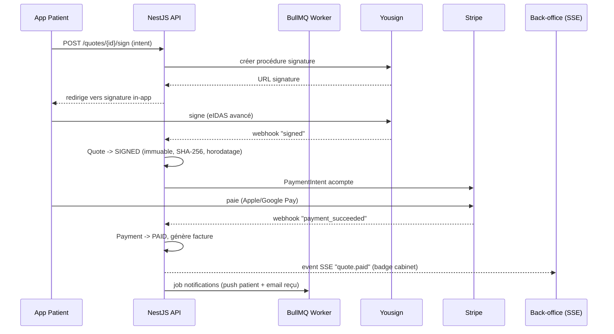

# 04 — Architecture technique

> Architecture cible du MVP, alignée sur les décisions de `01-critique-du-brief.md`, `02-decoupe-projet.md` et `03-temps-reel-et-sync.md`.
> Principe directeur rappelé : **managé par défaut, self-hosted seulement si la souveraineté l'exige et que tu peux l'opérer**. Un seul écosystème front (Flutter), un monolithe modulaire back (NestJS), tout en souverain managé Scaleway.

## Sommaire
1. Vue d'ensemble & principes
2. C4 niveau 1 — Contexte
3. C4 niveau 2 — Conteneurs
4. C4 niveau 3 — Composants (modules NestJS)
5. Flux clés (séquences)
6. Architecture Decision Records (ADR)
7. Contrats d'API (conventions REST)
8. Sécurité transverse
9. Environnements & déploiement

---

## 1. Vue d'ensemble & principes

| Couche | Choix | Pourquoi (réf.) |
|---|---|---|
| Front patient | **Flutter** (iOS/Android) | Codebase unique, accès natif. ADR-001 |
| Front cabinet | **Flutter Web/Desktop** | Un seul écosystème Dart. ADR-001 |
| API | **NestJS** modular monolith (TypeScript) | Structure sans micro-complexité. ADR-002 |
| Base | **PostgreSQL 16** (Scaleway Managed, HDS) | RLS multi-tenant, JSONB, partitioning. ADR-003 |
| Cache / files | **Redis 7** + **BullMQ** | Cache, sessions, jobs async. ADR-004 |
| Objets | **Scaleway Object Storage** (HDS) | Documents médicaux chiffrés. ADR-007 |
| Temps réel | **SSE** (cabinet) + **FCM** (push patient) | Événementiel, pas de WebSocket au MVP. ADR-005 |
| Observabilité | **PostHog** (EU Cloud) | Analytics + session replay + erreurs. ADR-006 |
| Secrets | **Scaleway Secret Manager** | Pas de Vault à opérer. ADR-007 |
| Paiement | **Stripe** + **GoCardless** | CB + SEPA. ADR-008 |
| Signature | **Yousign** (eIDAS avancé) | Backup Universign. ADR-008 |

**Principes d'architecture**
- **Multi-tenant strict par RLS** : le cloisonnement vit dans la base, pas seulement dans le code (cf. `05`).
- **Source de vérité unique = PostgreSQL.** Pas d'état « live » ailleurs.
- **Async par défaut** pour tout ce qui est lent/externe (mails, SMS, push, relances, appels Stripe/Yousign) via BullMQ.
- **Stateless API** : l'instance NestJS ne garde rien en mémoire, scalable horizontalement.
- **Conformité par le design** : chiffrement colonne, audit append-only, soft-delete, zéro PII dans logs/push — intégrés dès J0 car non rétrofittables.
- **Démo ≠ prod** : un drapeau d'environnement sépare les jeux de données fictifs (démo investisseurs) de la prod conforme HDS.

---

## 2. C4 niveau 1 — Contexte



**Acteurs** : patient (app), praticien & secrétariat (back-office, rôles distincts cloisonnés R.4127-72).
**Systèmes externes MVP** : Stripe, GoCardless, Yousign, FCM, OctoPush (SMS), Brevo (email), PostHog.
**Hors MVP** (interfaces prévues, non branchées) : Alma, Pro Santé Connect, France Connect, MSSanté, DMP/Mon Espace Santé, Almerys/Viamedis.

---

## 3. C4 niveau 2 — Conteneurs



| Conteneur | Techno | Rôle |
|---|---|---|
| App Patient | Flutter + Bloc (flutter_bloc) + Dio | UI patient, push FCM, biométrie, signature in-app |
| Back-office | Flutter Web/Desktop | Agenda, dossiers, devis, messagerie cabinet ; SSE pour le live |
| API | NestJS | REST, auth, logique métier, émission d'events, RLS context |
| Worker | NestJS (même codebase, process séparé) | Jobs BullMQ : emails, SMS, push, relances, appels externes, webhooks |
| PostgreSQL | Scaleway Managed DB HDS | Données, RLS, audit, partitioning |
| Redis | Scaleway Managed | Cache, sessions, files BullMQ, pub/sub SSE |
| Object Storage | Scaleway HDS | Documents (radios, devis PDF, photos), chiffrés côté serveur + URLs signées |

> **Un seul déployable applicatif** (l'image NestJS) lancé en deux modes : `api` et `worker`. Simplicité d'ops maximale.

---

## 4. C4 niveau 3 — Composants (modules NestJS)

Modular monolith : un module par domaine, frontières nettes, communication par services + events internes (EventEmitter → BullMQ pour l'async).

```
src/
├── core/                 # transverse
│   ├── auth/             # JWT, gardes, refresh, MFA
│   ├── tenancy/          # contexte cabinet, injection RLS (SET app.current_cabinet)
│   ├── rbac/             # rôles & permissions (praticien/secrétariat/patient)
│   ├── crypto/           # chiffrement colonne (KMS par cabinet)
│   ├── audit/            # AuditLog append-only (intercepteur)
│   ├── events/           # bus interne + pont BullMQ
│   └── files/            # Object Storage, URLs signées, antivirus
├── modules/
│   ├── cabinet/          # Cabinet, CabinetMembership, paramètres
│   ├── identity/         # User, Patient, Practitioner
│   ├── scheduling/       # Appointment, agenda, créneaux, liste d'attente
│   ├── records/          # MedicalRecord, documents, coffre-fort
│   ├── messaging/        # Conversation, Message, triage par règles
│   ├── quotes/           # Quote, QuoteItem, versioning, signature
│   ├── billing/          # Payment, PaymentSchedule, Stripe/GoCardless
│   ├── notifications/    # push FCM, email Brevo, SMS OctoPush
│   ├── consent/          # ConsentRecord (RGPD)
│   └── demo/             # seed de données fictives (🎬 démo investisseurs)
└── integrations/         # clients Stripe, Yousign, FCM, Brevo, OctoPush
```

**Règles de dépendance**
- `modules/*` peuvent dépendre de `core/*`, jamais l'inverse.
- Un module ne lit pas la table d'un autre module en direct : il passe par le service exposé.
- Tout effet de bord externe (mail, push, appel API tiers) passe par un **job BullMQ** (idempotent, retry).
- Toute écriture sur donnée de santé passe par `core/audit` (intercepteur) et `core/crypto`.

---

## 5. Flux clés (séquences)

### 5.1 Signature de devis + acompte (le wedge)



### 5.2 Notification cabinet → patient (push sans PII)

```
Cabinet ajoute un document → API écrit en base + audit
  → enqueue job notif → Worker → FCM push {type:"new_document", ref:"<uuid>"}  (aucune donnée de santé dans le payload)
  → App patient reçoit le push → appelle GET /documents/{uuid} (authentifié) pour afficher
```

### 5.3 Triage messagerie (règles, pas IA — garde-fou médicolégal)
Message entrant → moteur de **règles mots-clés** → calcule un *flag* `urgent|normal` qui **priorise visuellement** côté cabinet. Aucune décision clinique automatique, aucun contournement du secrétariat (cf. `03` §2).

---

## 6. Architecture Decision Records (ADR)

Format court : Contexte · Décision · Conséquences · Statut.

### ADR-001 — Flutter pour les deux fronts
- **Contexte** : app patient mobile + back-office cabinet ; exécution solo ; SEO sans objet sur app métier authentifiée.
- **Décision** : Flutter partout (mobile + Web/Desktop). Pas de Next.js.
- **Conséquences** : un seul langage (Dart), un pipeline. Risque résiduel : Flutter Web moins à l'aise sur UI très data-dense → mitigé par CanvasKit / option Flutter Desktop pour le back-office.
- **Statut** : Accepté.

### ADR-002 — Backend monolithe modulaire NestJS
- **Décision** : NestJS modular monolith, un déployable lancé en modes `api`/`worker`. Pas de microservices au MVP (le seul service Python n'apparaît qu'avec l'IA, post-MVP).
- **Conséquences** : simplicité de déploiement et de transaction ; frontières internes par modules. Découplage futur possible par extraction de module.
- **Statut** : Accepté.

### ADR-003 — Multi-tenant par Row-Level Security PostgreSQL
- **Décision** : une seule base, `cabinet_id` sur chaque table, **RLS activée** ; l'API positionne `SET app.current_cabinet_id` par requête.
- **Conséquences** : cloisonnement garanti au niveau base, même en cas de bug applicatif. Discipline requise : toujours ouvrir la transaction avec le bon contexte (cf. `core/tenancy`). Détail dans `05`.
- **Statut** : Accepté. Alternative écartée : une base par cabinet (ops ingérable en solo).

### ADR-004 — BullMQ (Redis) pour l'async, pas Temporal/NATS
- **Décision** : files & workflows simples via BullMQ sur le Redis existant.
- **Conséquences** : zéro infra supplémentaire ; retries/backoff/idempotence à la charge du dev. Temporal reconsidéré seulement si des workflows longs/complexes l'imposent (ré-évaluation post-traction).
- **Statut** : Accepté.

### ADR-005 — Temps réel : SSE + FCM, pas de WebSocket au MVP
- **Décision** : push patient via FCM (payload sans PII) ; mises à jour back-office via SSE (rafraîchissement ciblé). Socket.IO différé au besoin multi-postes collaboratif.
- **Conséquences** : couvre 90 % du « ressenti temps réel » à coût faible. Référence `03`.
- **Statut** : Accepté.

### ADR-006 — Observabilité via PostHog EU Cloud
- **Décision** : PostHog (EU) pour analytics produit + session replay + error tracking. Remplace Sentry. Logs/metrics infra via le managé Scaleway.
- **Conséquences** : un seul outil produit, hébergé UE (souveraineté). Veiller au masquage des PII dans les session replays (autocapture désactivée sur champs santé).
- **Statut** : Accepté.

### ADR-007 — Tout managé Scaleway, secrets via Secret Manager
- **Décision** : Postgres/Redis/Object Storage managés HDS ; Secret Manager managé ; conteneurs managés (pas de Kubernetes auto-géré au départ).
- **Conséquences** : moins d'ops, souveraineté conservée. K8s/Vault reconsidérés quand une équipe plateforme existe.
- **Statut** : Accepté.

### ADR-008 — Paiement Stripe + GoCardless, signature Yousign
- **Décision** : Stripe (CB, Apple/Google Pay), GoCardless (SEPA), Yousign (eIDAS avancé, backup Universign). Alma (financement) câblé mais activé post-MVP.
- **Conséquences** : conformité eIDAS et PCI déléguée aux prestataires ; webhooks idempotents indispensables.
- **Statut** : Accepté.

### ADR-009 — Exclusion des fonctions « dispositif médical »
- **Décision** : pas de vérification d'interactions médicamenteuses, pas d'aide à la prescription/décision, pas de triage clinique automatisé dans le MVP (cf. `01` §6.3, `07`).
- **Conséquences** : on reste hors périmètre MDR (règle 11). Le triage messagerie reste de la priorisation visuelle par règles.
- **Statut** : Accepté.

### ADR-010 — Séparation démo / prod
- **Décision** : un module `demo` + flag d'environnement isolent les données fictives (jalon 🎬 démo investisseurs) de toute donnée patient réelle.
- **Conséquences** : l'app « complète » est montrable sans ouvrir le périmètre conformité ; interdiction technique de mélanger fictif et réel.
- **Statut** : Accepté.

---

## 7. Contrats d'API (conventions REST)

### 7.1 Généralités
- Base URL : `https://api.nubia.health/v1`. Versionnée par préfixe (`/v1`).
- **Auth** : `Authorization: Bearer <JWT>`. Access token court (15 min) + refresh token rotatif. MFA sur comptes cabinet.
- **Tenancy** : le `cabinet_id` est dérivé du token (claim), jamais accepté depuis le client. L'API positionne le contexte RLS.
- **Format** : JSON, `snake_case` non — on garde `camelCase` côté JSON, mappé en `snake_case` en base.
- **Idempotence** : `Idempotency-Key` (header) obligatoire sur POST de paiement/signature.
- **Pagination** : curseur — `?limit=20&cursor=<opaque>`, réponse `{ data: [...], next_cursor }`.
- **Filtres/tri** : `?status=signed&sort=-created_at`.
- **Dates** : ISO 8601 UTC.

### 7.2 Format d'erreur (uniforme)
```json
{
  "error": {
    "code": "quote_already_signed",
    "message": "Ce devis est déjà signé et ne peut plus être modifié.",
    "request_id": "req_01H...",
    "details": []
  }
}
```
Codes HTTP : 400 (validation), 401 (auth), 403 (permission/RLS), 404, 409 (conflit d'état, ex. devis signé), 422 (règle métier), 429 (rate limit), 5xx.

### 7.3 Endpoints principaux (extrait)

**Auth**
```
POST   /auth/login                 # email + mot de passe (+ MFA challenge)
POST   /auth/mfa/verify
POST   /auth/refresh
POST   /auth/logout
```

**Scheduling**
```
GET    /appointments?from&to&status
POST   /appointments               # prise de RDV
PATCH  /appointments/{id}          # modif/annulation (transition d'état)
GET    /availability?practitioner_id&from&to
POST   /waitlist                   # inscription liste d'attente
```

**Records & documents**
```
GET    /patients/{id}/record
GET    /documents?category
POST   /documents                  # upload -> URL signée Object Storage
GET    /documents/{id}             # métadonnées + URL signée temporaire
```

**Quotes & signature**
```
GET    /quotes?status
POST   /quotes                     # création (lignes CCAM)
POST   /quotes/{id}/versions       # nouvelle version (tant que non signé)
POST   /quotes/{id}/sign           # déclenche Yousign (Idempotency-Key)
GET    /quotes/{id}/signature      # statut + certificat probant
```

**Billing**
```
POST   /payments/intent            # acompte (Idempotency-Key)
GET    /payments?quote_id
POST   /payment-schedules          # échéancier multi-jalons
GET    /invoices/{id}
```

**Messaging**
```
GET    /conversations
POST   /conversations/{id}/messages
PATCH  /messages/{id}              # marquer lu, reclasser flag
```

**Webhooks entrants** (vérification de signature obligatoire, traitement idempotent, réponse < 5 s puis job async)
```
POST   /webhooks/stripe
POST   /webhooks/gocardless
POST   /webhooks/yousign
```

### 7.4 SSE (back-office)
```
GET    /events/stream              # text/event-stream, scope cabinet
# events: appointment.updated, checkin.arrived, quote.paid, message.received
```

### 7.5 Versionnement & compat
- Changements rétro-compatibles uniquement dans `/v1` ; tout breaking change → `/v2`.
- Champs additifs autorisés ; suppression de champ = breaking.

---

## 8. Sécurité transverse
- **Chiffrement en transit** : TLS 1.2+ partout ; HSTS.
- **Chiffrement au repos** : disque (managé) + **chiffrement colonne** applicatif pour les données médicales, clé par cabinet via KMS (cf. `05` §chiffrement).
- **Scrubbing des logs** : middleware NER + regex retirant INS, noms, emails, tél avant émission (zéro PII en clair). Vérifié en CI.
- **Push/Email/SMS sans PII** : payloads = type + référence opaque ; le contenu se récupère authentifié.
- **RBAC + RLS** : double barrière (permissions applicatives + isolation base).
- **Rate limiting** & **brute-force** sur `/auth`.
- **Antivirus** sur tout upload avant stockage.
- **Secrets** hors code (Secret Manager) ; rotation documentée.
- **Audit append-only** de tout accès au dossier patient (qui, quoi, quand).

## 9. Environnements & déploiement
| Env | Données | Conformité | Usage |
|---|---|---|---|
| `dev` | fictives | légère | développement local |
| `staging` | fictives | proche prod | recette, **build démo investisseurs 🎬** |
| `prod` | réelles patients | **HDS/RGPD complète** | pilote cabinet 🚀 |

- **CI/CD** : GitHub Actions (lint, tests, build image, scan deps + secrets) → déploiement conteneurs managés Scaleway. Terraform pour l'infra.
- **Migrations** : versionnées (ex. Prisma Migrate / TypeORM migrations), jouées en déploiement, jamais à la main en prod.
- **Sauvegardes** : Postgres PITR managé + export chiffré Object Storage ; test de restauration documenté (cf. `07`).
- **Bascule prod** : conditionnée au Go/No-Go G3 (conformité réelle prête) — aucune donnée patient réelle avant.

## 10. Extension marketplace (scope global — cf. `11`)
La bascule en **marketplace santé** ajoute une face publique de découverte. Impacts архitecture :
- **Nouveaux modules** dans le monolithe NestJS : `directory` (annuaire/profils publics), `search` (recherche multi-axes), `geo` (proximité), `booking` (réservation cross-provider), `reviews` (avis modérés), `teleconsult` (vidéo).
- **Recherche** = **Meilisearch** réintégré (souverain) — indexe praticiens/spécialités/établissements/actes, facettes + typo-tolérance. (Révise `01` §3.3 : la recherche était reportée pour le mono-cabinet ; elle devient cœur produit.)
- **Géo** = **PostGIS** (colonne `geography(Point)`, `ST_DWithin`, tri par distance) ; géocodage via service EU ; tuiles carte souveraines (IGN/MapTiler EU/OSM).
- **Patient global** : `PatientAccount` au niveau plateforme (hors RLS cabinet) ; le dossier clinique reste tenant (RLS). Voir ADR-011 et `05`.
- **Disponibilités publiques** : projection lecture-publique des créneaux réservables, séparée du planning interne.
- **Téléconsultation** : brique WebRTC européenne, flux HDS.

### ADR-011 — Patient au niveau plateforme + annuaire public
- **Décision** : séparer l'**identité/compte patient** (plateforme, global) du **dossier médical** (tenant, RLS). Ajouter un annuaire public (lecture non authentifiée) alimenté par la recherche/géo.
- **Conséquences** : un patient unique réserve chez tous les praticiens ; le secret médical reste cloisonné par cabinet ; surface publique à sécuriser (rate-limit, cache, anti-scraping) ; AIPD à étendre.
- **Statut** : Accepté (révise le postulat « patient rattaché à un cabinet » de `05`).

> Détail des entités et politiques RLS : `05-modele-de-donnees.md` (dont section marketplace). Règles métier par écran : `06-specs-fonctionnelles.md`. Scope marketplace : `11-marketplace-recherche.md`. Checklist réglementaire : `07-conformite.md`.
