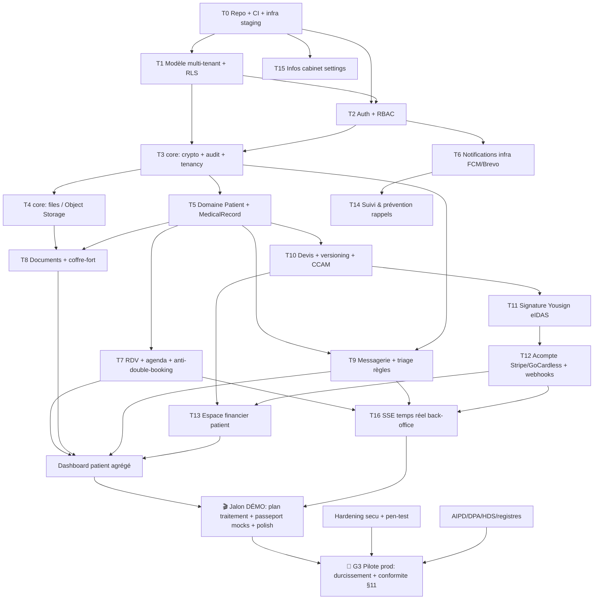

# 08 — Plan d'action, dépendances & déploiement

> Plan d'exécution **tâche par tâche** pour un dev solo, ordonné par **dépendances** (rien ne démarre tant que son bloquant n'est pas vert), avec une **porte de validation (gate) testée à fond** sur chaque tâche. Aligné sur `02` (roadmap), `04` (archi), `05` (données), `06` (specs), `07` (conformité).
>
> Philosophie : **aucune tâche n'est « finie » sans ses tests.** La definition of done de ce projet inclut la couverture, les tests de sécurité (RLS/RBAC) et le passage au vert de la CI. On vise une couverture **très élevée (cible ≥ 90 % lignes / ≥ 85 % branches, 100 % sur le code métier critique)**, complétée par du **mutation testing** pour que la couverture *veuille dire quelque chose*.

## Sommaire
1. Comment lire ce plan
2. Graphe de dépendances (DAG)
3. Ordre d'exécution linéaire (T0 → T24)
4. Gabarit de « gate de validation » par tâche
5. Stratégie de tests (la partie monstrueuse)
6. Pipeline CI/CD & seuils bloquants
7. Procédure de déploiement (staging → démo → prod G3)
8. Anti-patterns à éviter

---

## 1. Comment lire ce plan
- Les tâches sont notées **T0 … T24**, dans l'ordre où tu peux les attaquer **seul**.
- Chaque tâche indique **Bloquée par** (ne pas commencer avant) et **Débloque** (ce qu'elle ouvre).
- Une tâche n'avance à la suivante qu'après sa **gate** verte (§4).
- 🟧 = prod · 🎭 = démo mockée (cf. `02`/`06`).
- Règle d'or : **tu ne codes jamais une tâche dont un bloquant n'est pas Done+testé.** C'est ce qui évite de bâtir sur du sable.

---

## 2. Graphe de dépendances (DAG)



**Lecture rapide des verrous structurants**
- **T1 (RLS) et T2 (Auth/RBAC) bloquent presque tout** : aucune donnée métier sans isolation tenant + authz.
- **T3 (crypto/audit) bloque tout stockage de donnée de santé** : pas de `MedicalRecord`, message ou note avant que le chiffrement et l'audit existent.
- **Le wedge est une chaîne stricte** : T10 → T11 → T12 → T13 (devis → signature → acompte → espace financier).
- **Le dashboard (D) est tardif** par nature : il agrège RDV + docs + messages + finances.
- **La démo (M) dépend du socle réel + mocks** ; **le pilote prod (G3) dépend de la conformité** (`07` §11), pas seulement du code.

---

## 3. Ordre d'exécution linéaire (T0 → T24)

> Fais-les dans cet ordre. Chaque ligne = une tâche avec sa gate (§4). Les `[🎭]` peuvent être mockées pour la démo et durcies après.

### Bloc A — Fondations (rien de métier avant que ce bloc soit vert)
| T | Tâche | Bloquée par | Débloque |
|---|---|---|---|
| **T0** | Repo, CI (lint+test+build+scan), Terraform infra **staging**, Postgres/Redis/Object Storage managés, secrets | — | tout |
| **T1** | Modèle multi-tenant + **RLS** (cabinet, app_user, membership) + migrations | T0 | T2,T3 |
| **T2** | **Auth** (JWT, refresh, MFA) + **RBAC** (rôles praticien/secrétariat/patient) | T0,T1 | endpoints protégés |
| **T3** | `core/` : **tenancy** (SET app.current_cabinet_id), **crypto** (KMS/clé par cabinet), **audit** append-only | T1,T2 | tout stockage santé |
| **T4** | `core/files` : upload Object Storage, URLs signées, **antivirus**, sha256 | T3 | T8 |

### Bloc B — Domaines cœur
| T | Tâche | Bloquée par | Débloque |
|---|---|---|---|
| **T5** | Patient + MedicalRecord (chiffré) + consentements | T3 | T7,T8,T9,T10 |
| **T6** | Notifications infra : FCM (push **sans PII**) + Brevo email + OctoPush SMS, jobs BullMQ | T2 | T7,T14 |
| **T7** | RDV + agenda + créneaux + **contrainte anti-double-booking** + rappels | T5,T6 | T16,D |
| **T8** | Documents + coffre-fort patient | T4,T5 | D |
| **T9** | Messagerie chiffrée + **triage par règles** (flag visuel, jamais décisionnel) | T5,T3 | T16,D |
| **T15** | Infos pratiques cabinet (settings) `[facile, peut être avancé]` | T0 | D |

### Bloc C — Wedge monétisable (chaîne stricte)
| T | Tâche | Bloquée par | Débloque |
|---|---|---|---|
| **T10** | Devis + lignes CCAM + **versioning** (immuable si signé) | T5 | T11,T13 |
| **T11** | Signature **Yousign** (eIDAS avancé) + certificat probant + webhook idempotent | T10 | T12 |
| **T12** | Acompte **Stripe**/GoCardless + Apple/Google Pay + webhooks idempotents + facture | T11 | T13,T16 |
| **T13** | Espace financier patient (consultation 🟧 ; échéancier/financement `[🎭]`) | T10,T12 | D |

### Bloc D — Temps réel, agrégation, suivi
| T | Tâche | Bloquée par | Débloque |
|---|---|---|---|
| **T14** | Suivi & prévention : moteur de rappels 🟧 (scénarios cliniques `[🎭]`) | T6 | démo |
| **T16** | **SSE** back-office (appointment.updated, quote.paid, message.received) | T7,T9,T12 | démo |
| **D / T17** | **Dashboard patient** agrégé (RDV, docs, messages, paiements, suivis, actions) | T7,T8,T9,T13 | démo |

### Bloc E — Démo investisseurs 🎬
| T | Tâche | Bloquée par | Débloque |
|---|---|---|---|
| **T18** | Plan de traitement `[🎭]` (données fictives) | T5 | démo |
| **T19** | Passeport implantaire `[🎭]` (données fictives) | T5 | démo |
| **T20** | Module `demo` : **seed de données fictives réalistes** + scénario scripté + polish UI | T17 | **Jalon GD** |

> **Jalon GD (🎬 démo)** : app patient complète (rubriques 1-12) jouable de bout en bout sur données fictives. Parcours fluide, rien ne casse. → pitch / poursuite vers prod.

### Bloc F — Vers le pilote prod 🚀 (G3)
| T | Tâche | Bloquée par | Débloque |
|---|---|---|---|
| **T21** | **Durcissement sécurité** : rate-limit, en-têtes, revue scrubbing logs, rotation secrets | socle | T24 |
| **T22** | **Pré-audit / pen-test** ciblé + correctifs | T21 | T24 |
| **T23** | **Conformité** : AIPD validée DPO, DPA signés, hébergement HDS contractualisé, registres, procédure violation (`07` §11) | parallèle | T24 |
| **T24** | **Bascule prod** : sauvegardes+restore testés, monitoring/alerting, runbook, onboarding cabinet pilote | T21,T22,T23 | **G3** |

> **G3 = porte la plus stricte.** Aucune donnée patient réelle tant que les 8 points de `07` §11 ne sont pas ☑. Démo = données fictives ; prod = conformité complète.

---

## 4. Gabarit de « gate de validation » par tâche

Copie-colle cette checklist pour **chaque** tâche. Tant qu'une case n'est pas cochée, la tâche n'est pas Done et la suivante ne démarre pas.

```
GATE — T<n> <nom>
[ ] Specs : critères d'acceptation de `06` couverts (Gherkin → tests)
[ ] Tests unitaires : logique métier, branches d'erreur, cas limites
[ ] Tests d'intégration : DB réelle (testcontainers), transactions, contraintes
[ ] Tests SÉCURITÉ : RLS (pas de fuite inter-cabinet) + RBAC (403 attendus)
[ ] Tests de contrat API : schéma requête/réponse + codes d'erreur (`04` §7)
[ ] Zéro PII : assertion qu'aucune donnée santé n'apparaît dans logs/push/email
[ ] Idempotence (si paiement/signature/webhook) : rejouer ne double pas l'effet
[ ] Couverture : ≥ 90% lignes / ≥ 85% branches (100% sur le code critique)
[ ] Mutation testing : score acceptable sur le module métier (pas de tests fantômes)
[ ] Audit : toute écriture/accès santé crée une entrée audit_log (testé)
[ ] CI verte (lint + types + tests + scans deps/secrets)
[ ] Déployé en staging + smoke test du parcours bout-en-bout
[ ] Doc à jour si contrat d'API / schéma / ADR impacté
```

**Gates « sécurité » renforcées** (T1, T2, T3) : ajoute un test qui **tente explicitement** d'accéder aux données d'un autre cabinet et **doit échouer**, et un test qui vérifie que le rôle Postgres applicatif **ne bypasse pas** la RLS.

---

## 5. Stratégie de tests (la partie monstrueuse)

### 5.1 Pyramide cible (par volume)
```
        /\        E2E (parcours réels)         ~10%
       /  \       Intégration (API+DB+tiers)   ~30%
      /----\      Unitaires (logique pure)     ~60%
```
Beaucoup d'unitaires rapides, une bonne couche d'intégration (où vivent les vrais bugs santé : RLS, transactions, webhooks), une fine couche E2E sur les parcours qui font vendre (RDV, devis→signature→acompte).

### 5.2 Outillage par couche
| Couche | Back (NestJS) | Front patient (Flutter) | Back-office (Flutter Web) |
|---|---|---|---|
| Unitaire | **Jest** | `flutter_test` | `flutter_test` |
| Intégration | **Jest + Supertest + Testcontainers (Postgres réel)** | `integration_test` + mocks Dio | idem |
| Contrat API | tests de schéma (zod/openapi) côté serveur + client généré | client typé vérifié | idem |
| E2E | scénario API bout-en-bout | `integration_test` sur device/emulateur | **Playwright** (web) |
| Charge | **k6** sur endpoints chauds (agenda, RDV, webhooks) | — | — |
| Mutation | **Stryker (StrykerJS)** | `mutation_test` (si dispo) ou ciblé | — |

### 5.3 Tests obligatoires spécifiques santé (non négociables)
1. **Isolation tenant (RLS)** : pour chaque table multi-tenant, un test « cabinet A ne voit/écrit jamais les données de cabinet B ». C'est **le** test critique.
2. **Cloisonnement RBAC** (R.4127-72) : le secrétariat reçoit 403 sur le contenu clinique.
3. **Chiffrement** : la donnée écrite en base est bien du ciphertext ; déchiffrement correct ; clé par cabinet.
4. **Audit append-only** : impossible d'UPDATE/DELETE `audit_log` avec le rôle applicatif ; chaque accès santé journalisé.
5. **Zéro PII** : payloads FCM/SMS/email et lignes de logs ne contiennent jamais de donnée de santé (test d'assertion + lint custom).
6. **Idempotence webhooks** : rejouer un webhook Stripe/Yousign ne crée pas de doublon (clé d'idempotence).
7. **Immutabilité devis signé** : toute modif d'un devis `signed` renvoie 409.
8. **Anti-double-booking** : deux RDV qui se chevauchent sur un praticien → rejet (contrainte d'exclusion testée).
9. **Consentement** : appeler une fonction santé sans `consent_record` valide → refus.

### 5.4 Sur la cible « 100% coverage » — la nuance qui compte
Vise haut, mais **la couverture n'est pas la correction**. 100 % de lignes peut cacher des tests qui n'assertent rien. Donc :
- **Seuils CI** : ≥ 90 % lignes / ≥ 85 % branches global ; **100 % sur les modules critiques** (`core/crypto`, `core/audit`, `core/tenancy`, `quotes`, `billing`, `auth`).
- **Mutation testing** sur ces modules critiques : c'est lui qui prouve que tes tests *attrapent* les régressions (un test qui survit aux mutants est un faux test).
- **N'exclus pas** le code critique de la couverture ; **exclus** le trivial (DTO purs, fichiers de config) pour ne pas courir après un 100 % cosmétique.
- **Tests de non-régression** : chaque bug trouvé = un test qui le reproduit avant correction.

### 5.5 Données de test
- **Jamais de vraie donnée patient** en dev/staging/CI. Générateurs de données fictives (faker) + le module `demo`.
- Jeux de données déterministes pour les tests (seed fixe), aléatoires pour le fuzzing léger des validations.

---

## 6. Pipeline CI/CD & seuils bloquants

**À chaque push / PR (bloquant — merge interdit si rouge)** :
1. Lint + format + **type-check** (strict).
2. Tests unitaires + intégration (Testcontainers Postgres) → **seuils de couverture** appliqués.
3. **Tests sécurité** (RLS/RBAC) dans la suite.
4. **Scan dépendances** (vulnérabilités) + **scan secrets** (pas de secret commité).
5. Build images.
6. (Nightly, plus lent) **mutation testing** + **k6** charge + E2E complet.

**Règles**
- Branche `main` toujours déployable. Travail sur branches courtes + PR (même en solo : la PR force la relecture différée + déclenche la CI).
- **Aucun merge sous le seuil de couverture.** La CI casse le build si la couverture baisse sous le seuil ou si un module critique passe sous 100 %.
- Déploiement **staging automatique** sur merge `main` ; **prod manuel** (bouton), conditionné au jalon.

---

## 7. Procédure de déploiement (staging → démo → prod)

### 7.1 Staging (continu)
- Déploiement auto à chaque merge. Données **fictives**. Sert à la recette et à **builder la démo investisseurs**.
- Smoke tests post-déploiement (parcours RDV + devis) automatiques ; rollback auto si rouge.

### 7.2 Build démo investisseurs 🎬 (jalon GD)
- Tag de version `demo-x.y`. Seed `demo` chargé. Scénario scripté vérifié manuellement (parcours sans accroc).
- **Garde-fou** : environnement isolé, aucune connexion à une base de prod, aucune vraie donnée.

### 7.3 Bascule prod 🚀 (G3 — la porte stricte)
Pré-requis **tous ☑** (cf. `07` §11) :
1. Hébergement **HDS** contractualisé.
2. **AIPD validée** DPO.
3. **DPA** signés (tous sous-traitants).
4. Registre traitements + politique de confidentialité.
5. Chiffrement colonne + RLS + audit + scrubbing **testés**.
6. **Sauvegardes + test de restauration** OK.
7. Procédure **violation de données**.
8. **RC pro santé** souscrite.

Procédure de release prod :
- Migration DB jouée automatiquement, **réversible** (plan de rollback écrit).
- Déploiement **blue/green** ou rolling ; health-checks avant bascule du trafic.
- Monitoring/alerting actifs (erreurs, latence, jobs en échec) ; **runbook d'incident** à portée.
- Fenêtre de surveillance renforcée post-release (le solo *est* l'astreinte — planifie-la).

### 7.4 Rollback
- Tout déploiement prod doit pouvoir **revenir en arrière** en < 15 min (image précédente + migration réversible). Testé au moins une fois en staging.

---

## 8. Anti-patterns à éviter
- ❌ Commencer une tâche dont le bloquant n'est pas Done+testé (tu bâtis sur du sable).
- ❌ Mocker la donnée de santé en prod « juste pour la démo » — démo et prod sont **séparées** (ADR-010).
- ❌ Chasser le 100 % de couverture sur du trivial pendant que `core/crypto` a des tests faibles.
- ❌ Webhooks non idempotents (double paiement / double facture garantis un jour).
- ❌ Repousser RLS/chiffrement/audit « pour plus tard » : non rétrofittables sans douleur.
- ❌ Logs avec PII « temporairement pour debug » : interdit, même en dev (mauvaise habitude).
- ❌ Déployer en prod sans plan de rollback testé.

> Récap des jalons Go/No-Go : `02` §G. Obligations de la porte prod : `07` §11. Contrats testés : `04` §7. Règles métier à couvrir : `06`.
