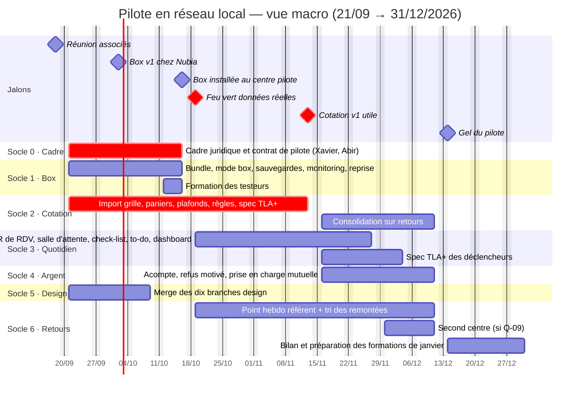
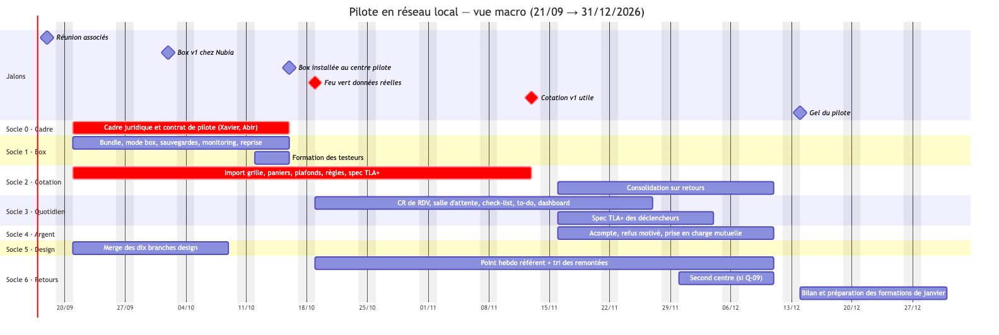
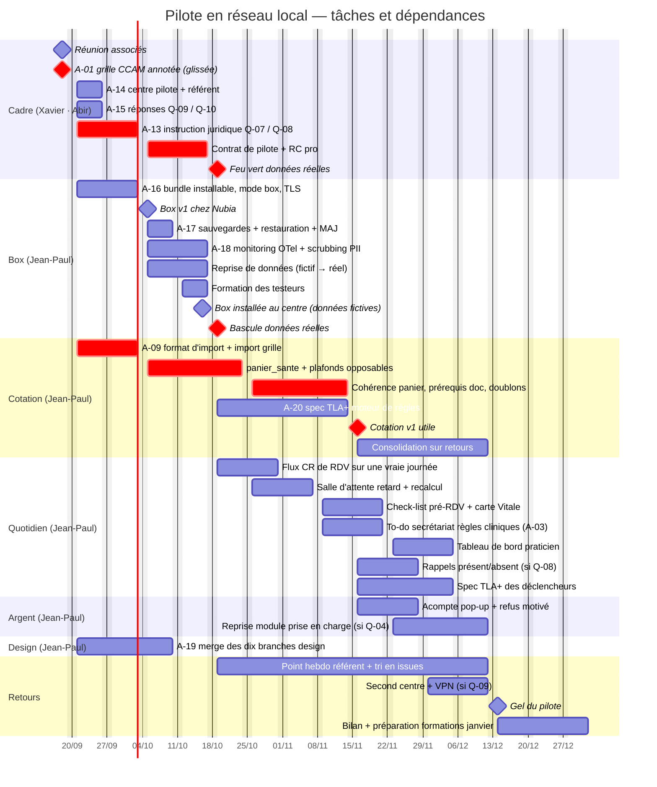
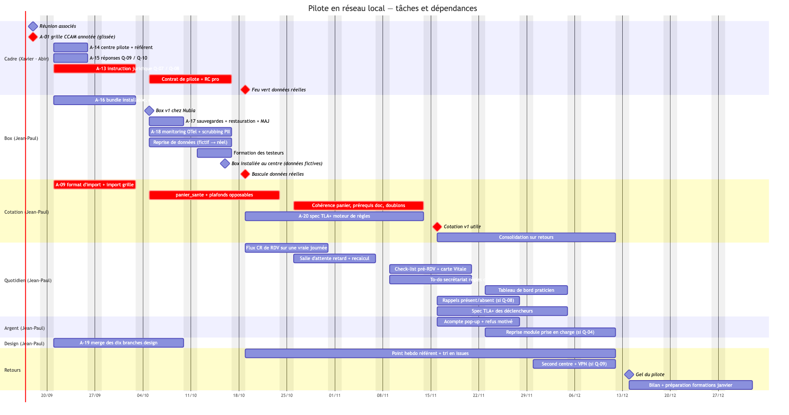

# Atelier 2026-09-16 — Périmètre minimal : tester vite, en réseau local

- **Participants** : Xavier Barraud, Jean-Paul Jacquot (échange associés ; actions adressées à Abir Talbi)
- **Objet** : fixer le périmètre minimal du module dentaire et en tirer la roadmap présentée aux associés le **vendredi 2026-09-18**
- **Périmètre** : logiciel Nubiadoc. Le cadre juridique n'est traité que là où il conditionne le test en centre réel.
- **Version publiée** : <https://claude.ai/artifact/GRquaSrp2tTFWaGWr5TNpf>
- **Séance précédente** : [2026-09-08 — cadrage logiciel métier](2026-09-08-cadrage-logiciel-metier.md)

## 1. En une phrase

L'objectif est de **mettre le logiciel entre les mains de vrais utilisateurs
le plus vite possible**, dans les centres d'Abir. Sans hébergement certifié,
cela impose un **serveur dans le réseau local du centre** plutôt qu'un VPS.
Le code s'y prête déjà à ~70 % ; ce qui manque n'est pas l'architecture mais
le cadre du pilote, la cotation bloquante, et l'acceptation de ce qu'un
serveur local ne peut **pas** faire.

## 2. Ce que « périmètre minimal » veut dire, ligne par ligne

Le compte rendu brut de la séance, relu contre le code au 2026-09-16.

| Ligne du CR | Sens retenu | État dans le code |
|---|---|---|
| Fonctionnement 100 % hors ligne | Un serveur dans le LAN du centre, les postes s'y connectent en navigateur. Résilience = sauvegardes + restauration + continuité du serveur, **pas** un mode déconnecté sur chaque poste | 🟠 `infra/deploy` = stack complète podman sur un LXC (Postgres, API, nginx + 5 fronts). Le seul « offline » côté client est un cache lecture des RDV (`nubia_data/src/cache/drift/`) |
| Mode local multi-sites, 10 à 15 cabinets | Le groupe d'Abir. Aucune donnée de santé ne transite par internet public tant que l'hébergement n'est pas certifié | ⛔ Rien au-dessus du cabinet : pas d'entité « groupe », pas de vue inter-centres. Un user peut appartenir à N cabinets (`cabinet_membership`), un patient reste cloisonné par cabinet (RLS) |
| Pilotage à distance sans accès aux données | Pilotage **technique** : état des serveurs, logs anonymisés, via une partition séparée, OpenTelemetry. Jamais les données métier | ⛔ `tracing` seul, pas d'OpenTelemetry, scrubbing PII des logs non fait (`docs/07` §4.4 ☐) |
| Connectivité : événements et alarmes « TLA » | Les algorithmes qui déclenchent des événements (rappels, alertes, libération de créneau) **et les règles de cotation à contrainte légale** sont spécifiés et vérifiés formellement en **TLA+**. Garantie interne, pas certification réglementaire | ⛔ Aucune spec. Les déclencheurs existent (`reminders.rs`, `recall_campaigns.rs`, `patient_alerts.rs`, `realtime/`), le moteur de règles aussi (`consultation_act_create.rs`) |
| Analyse en local | Un LLM sur le serveur du centre qui transforme les notes de RDV en compte rendu. Conditionné au matériel (cf. D-03) | ⛔ Zéro IA. Post-MVP |
| Enregistrement du compte rendu | Saisie du CR de consultation | ✅ `cr_templates.rs`, `consultations.rs` |
| Rappel des patients | Rappels RDV et relances | ✅/🟠 4 kinds + worker push/e-mail/SMS. Manque la réponse présent/absent et le rappel par acte (lot 2 du 08/09). **Tout canal sortant passe par internet** — cf. Q-08 |
| Interface patient | À cadrer : un serveur LAN n'est **pas joignable** depuis le téléphone du patient chez lui | ✅ 30 features dans `app_patient`, mais cf. Q-06 |
| Certifications | « Faire le maximum sans certification » | ⛔ HDS ☐, Ségur ☐, SESAM-Vitale ☐. Analyse en §4 |
| Cotation (absente du CR brut) | **Reste le chemin critique** (D-01 reconduit). Mal exprimée dans le périmètre minimal, elle y est réintégrée | 🟠 Moteur bloquant présent, catalogue vide de sa substance (`panier_sante` NULL partout). Dépend de `A-01` |

## 3. Décisions

| # | Décision | Conséquence |
|---|---|---|
| D-05 | Le MVP tourne sur un **serveur dans le réseau local** du centre pilote, pas sur un VPS ni dans le cloud, pour obtenir des retours utilisateurs au plus vite | `infra/deploy` devient la base de la « box » ; l'app patient à distance sort du MVP (Q-06) |
| D-06 | **Aucune donnée de santé ne transite par internet public** tant que l'hébergement certifié n'est pas acquis | Coupe FCM, Brevo, Twilio, Yousign, Stripe, PostHog, Google Fonts sur la box. Canaux sortants à instruire (Q-08) |
| D-07 | Le pilotage à distance est **technique seulement** : état des serveurs et logs anonymisés, via une partition séparée, OpenTelemetry. Nubia n'a jamais accès aux données métier | Condition de l'analyse HDS §4. Impose le scrubbing PII des logs avant tout export |
| D-08 | Les déclencheurs d'événements et les règles de cotation à contrainte légale sont **spécifiés et vérifiés en TLA+** | Nouveau livrable transverse ; garantie interne présentée comme telle, jamais comme certification |
| D-09 | La **cotation reste le chemin critique** (reconduit D-01) et figure explicitement dans le périmètre minimal | Réordonne la roadmap §6 |
| D-10 | Le LLM local pour les comptes rendus est une **option post-MVP**, conditionnée au matériel du centre (cf. D-03) | Hors roadmap fin d'année ; prérequis matériel à chiffrer (Q-10) |

## 4. Le serveur local nous protège-t-il ? Analyse honnête

La séance a posé la question elle-même : « l'idée du full offline semblait
nous protéger, peut-être une erreur ». Réponse en trois parties, à faire
valider par un juriste (Q-07) — rien ici n'est une position officielle.

### 4.1 Ce que le LAN retire : l'hébergement certifié HDS

L'obligation de certification HDS (art. L.1111-8 CSP) vise l'hébergement de
données de santé **pour le compte d'un tiers**. Un centre qui héberge ses
propres données sur son propre serveur, dans ses locaux, n'est pas dans ce
cas. Le LAN retire donc bien ce verrou, **à trois conditions** :

1. Le serveur appartient au centre (ou au groupe, s'il s'agit de la même
   entité juridique). Nubia fournit le logiciel, pas l'hébergement.
2. Nubia **n'administre pas** le système qui contient les données — c'est
   l'activité « infogérance » du référentiel HDS. D'où D-07 : notre accès se
   limite à une partition de télémétrie sans donnée de santé, et les mises à
   jour sont appliquées par un process qui ne nous ouvre pas les données.
3. Si le groupe d'Abir est constitué de plusieurs sociétés et qu'un serveur
   central en sert d'autres, la société qui l'héberge le fait « pour le compte
   de tiers ». À vérifier avant tout multi-site (Q-09).

### 4.2 Ce que le LAN ne retire pas

- **RGPD, en totalité.** Le centre est responsable de traitement : registre,
  information des patients, AIPD (données de santé → obligatoire ; le centre
  en a normalement déjà une pour son logiciel actuel, à mettre à jour),
  sécurité art. 32 (chiffrement, sauvegardes, journalisation, gestion des
  accès). Ce sont **nos** moyens techniques qui la rendent possible.
- **Secret médical** (R.4127-72 CSP) et cloisonnement des accès par rôle —
  déjà dans le code (RLS, rôles), à documenter pour le centre.
- **Responsabilité de l'éditeur** : RC pro (`docs/07` §10.8), contrat de
  pilote qui dit noir sur blanc que Nubia ne voit aucune donnée.
- **Reprise de données** : importer l'export du logiciel actuel dans Nubia
  (connecteur DSIO à développer, cf. socle 1) met de vraies données dans la
  box dès le premier jour.
  C'est précisément le test voulu — et c'est le moment où tout le §4.2 doit
  être en place.

### 4.3 Ce que le LAN coûte

« 100 % hors ligne » n'est pas « 100 % des fonctionnalités ». Sur une box
sans sortie internet :

| Perdu | Pourquoi | Alternative pilote |
|---|---|---|
| App patient à distance | Le serveur n'est pas joignable de l'extérieur | Q-06 : hors MVP, ou tablette en salle d'attente sur le LAN |
| Rappels SMS / e-mail | Passent par un opérateur, donc par internet | Q-08 : liste blanche sortante à contenu minimal, ou rien |
| Push mobile | FCM = Google | Idem |
| Signature électronique du devis | Yousign = cloud | Signature sur tablette au cabinet, valeur juridique à cadrer (`docs/07` §5) |
| Acompte en ligne, paiement CB | Stripe = cloud | Encaissement manuel et TPE du centre (déjà en base) |
| Recherche marketplace, avis | Fonctions plateforme | Hors périmètre dentaire |

Le pilote doit accepter ces coupes explicitement, ou décider d'une **liste
blanche sortante** (Q-08). Une sortie « SMS avec date, heure et adresse
seulement » est la pratique standard du marché ; ce qu'elle expose, c'est le
numéro du patient et le fait qu'il a rendez-vous dans un centre dentaire. Ce
n'est pas rien, ce n'est pas non plus le dossier médical. C'est un arbitrage
juridique, pas technique.

## 5. Arbitrages ouverts

Reportés dans le [README](README.md#arbitrages-en-attente) : `Q-06` à `Q-10`.
Les `Q-01` à `Q-05` du 08/09 restent ouverts.

## 6. Roadmap proposée pour le 2026-09-18

> **Remplacée le 2026-09-18.** Les associés ont retenu un premier jalon
> « carte Vitale → dossier patient → facture » (D-11) ; la roadmap courante
> est au [CR du 18/09 § 6](2026-09-18-perimetre-initial-logiciel-dentaire.md#6-ce-que-ça-change-dans-la-roadmap).
> Ce qui suit est conservé comme base de travail.

Contrainte de capacité : **une personne et cinq agents**. Horizon : 15
semaines, du 21/09 au 31/12. Les socles se recouvrent ; l'ordre est celui des
dépendances, pas du calendrier.

### Socle 0 — Cadre du pilote · semaines 1-2 · non codant

Sans ça, la box ne reçoit que des données fictives.

- Trancher Q-07 (ce qu'on peut faire avec de vraies données sans
  certification) et Q-08 (canaux sortants) avec un juriste ou le référentiel
  CNIL des professionnels de santé.
- Trancher Q-09 (structure juridique du groupe, un serveur ou plusieurs).
- Contrat de pilote : responsabilités, ce que Nubia voit (rien), durée,
  réversibilité. RC pro éditeur.
- Choisir le centre pilote et son référent (action de séance).

**Bloque** le passage aux données réelles du socle 1.

### Socle 1 — La box · semaines 1-4

Partir de `infra/deploy`, ne rien réinventer. Existant ~70 %.

- Bundle installable sur un mini-PC : les trois conteneurs + les cinq fronts,
  installation en une commande, mise à jour par bundle d'images signé,
  applicable sans accès de Nubia aux données.
- Mode « box » explicite : tous les services externes désactivés par
  configuration, polices embarquées (`google_fonts` → assets), PostHog retiré.
- TLS interne (autorité locale) pour que les postes du centre y accèdent en
  HTTPS sans internet.
- Sauvegardes chiffrées quotidiennes sur second disque, **restauration
  testée** — c'est la « résilience » du MVP. Onduleur côté centre.
- Partition monitoring : collecteur OpenTelemetry, métriques + logs **après
  scrubbing PII** (`docs/07` §4.4), tunnel sortant vers notre supervision.
  Rien d'autre ne sort.
- **Reprise de données depuis le logiciel actuel du centre — à développer.**
  `data_import_job` (0168) n'est qu'une table de suivi ; aucun parseur
  n'existe (le CR du 08/09 l'avait notée ✅ à tort, corrigé par
  `docs/17-benchmark-dental-pilot.md`). Connecteur **DSIO** en premier — le
  format d'échange standard des logiciels dentaires français, il couvre
  Logos, Desmos, Veasy — puis CSV Doctolib. Sans lui, la box du centre pilote
  démarre vide.

*Livrable* : box v1 chez Nubia en semaine 2, installée au centre pilote en
semaine 4 sur données fictives, testeurs onboardés. Le connecteur DSIO est le
seul chantier de code du socle 1 qui parte de zéro : le démarrer en semaine 1.

*Benchmark* : `docs/17-benchmark-dental-pilot.md` §5.3 liste les ajouts à
faible effort que la comparaison avec Dental Pilot impose aux socles 3 et 4.

### Socle 2 — Cotation et règles bloquantes · dès réception de A-01 · continu

Le chemin critique, inchangé depuis le 08/09. Existant ~60 %.

- Import de la grille CCAM annotée d'Abir (format préparé, `A-09`).
- `panier_sante` renseigné, plafonds opposables, cohérence de panier par
  devis, prérequis documentaire par acte, détection de doublon.
- **Spec TLA+** du moteur de règles (D-08) : invariants « aucun acte facturé
  hors règle », vérifiés par model checking, puis validation de traces contre
  le code Rust. Premier livrable formel du projet.

*Version utile pour fin d'année* : paniers et plafonds bloquants sur les actes
les plus fréquents, même sans catalogue exhaustif.

### Socle 3 — Quotidien du cabinet, guidé par les retours · semaines 4-10

Lot 2 du 08/09, existant ~80 %. L'ordre interne sera dicté par ce que les
testeurs remontent ; ne pas figer.

- Compte rendu de RDV : vérifier que le flux existant tient la vraie journée
  d'un praticien (modèles, saisie rapide, lien à l'acte).
- Salle d'attente : retard praticien, recalcul, notification des suivants.
- Check-list pré-RDV bloquante, rappel carte Vitale au check-in.
- To-do secrétariat par règles cliniques (`A-03`).
- Tableau de bord praticien : facturé du jour, du mois, par centre.
- Rappels avec réponse présent/absent — **si** Q-08 ouvre un canal sortant.
- **Spec TLA+** des déclencheurs d'événements (D-08) : un rappel part une
  fois, un créneau libéré n'est attribué qu'une fois.

### Socle 4 — Argent · semaines 8-12

- Pop-up d'acompte à l'acceptation du devis, refus motivé (encaissement au
  cabinet, pas en ligne).
- Module prise en charge mutuelle d'Abir : après la présentation du 18/09 et
  Q-04. Reprise dans Nubia, pas intégration d'un outil tiers.

### Socle 5 — Design · en parallèle, continu

Dix branches `agent/design-ecran-*` ouvertes. Les testeurs jugent en trente
secondes : à merger avant l'installation au centre (semaine 4), pas après.

### Socle 6 — Boucle de retours · dès la semaine 4

- Un point hebdomadaire avec le référent du centre.
- Remontée in-app (`support.rs` existe), triée en issues Forgejo chaque semaine.
- Télémétrie technique (socle 1) : erreurs, latences, crashs — sans données.

### Calendrier

| Semaines | Dates | Jalons |
|---|---|---|
| 1-2 | 21/09 – 02/10 | Socle 0 lancé · box v1 chez Nubia · design mergé · A-01 reçue → import CCAM |
| 3-4 | 05/10 – 16/10 | Box installée au centre pilote, données fictives · testeurs formés · monitoring actif |
| 5-8 | 19/10 – 13/11 | **Bascule données réelles si socle 0 vert** · cotation bloquante v1 + spec TLA+ · quick wins pilotés par retours |
| 9-12 | 16/11 – 11/12 | Acompte, refus motivé, prise en charge mutuelle · stabilisation · second centre si Q-09 tranché |
| 13-15 | 14/12 – 31/12 | Gel, bilan du pilote, préparation des formations de janvier |

### Gantt

Deux vues, en Mermaid (rendu par Forgejo) et en PNG pour les slides
(`img/2026-09-16-gantt-*.png`). Jours ouvrés, week-ends exclus ; les dates de
fin glissent donc de un à deux jours par rapport au tableau ci-dessus. En rouge,
le chemin critique : cadre juridique → feu vert données réelles, et grille CCAM
→ cotation v1.

**Vue macro, par socle**

**Vue détaillée, tâches et dépendances**

Lecture : `after x` = la tâche ne démarre qu'à la fin de `x`. Les tâches
marquées « si Q-nn » n'existent que si l'arbitrage est tranché dans ce sens.
Capacité : jamais plus de trois chantiers de code en parallèle (box, cotation,
un troisième), le reste attend.

### Ce qu'on ne promet pas pour fin d'année

Dit clairement aux associés pour ne pas le réentendre en décembre :

- Télétransmission SESAM-Vitale, FSE, NOÉMIE — quel que soit le scénario (Q-01).
- Référencement Ségur et subventions associées (Q-03).
- Hébergement cloud HDS : c'est le chemin pour vendre au-delà du groupe
  d'Abir, il commence après le pilote.
- App patient utilisable de chez soi (Q-06).
- LLM local pour les comptes rendus (D-10) — matériel et cadre AI Act à instruire.
- Multi-site interconnecté au-delà du second centre.

### Options après le pilote

- **Multi-site** : un serveur central au siège du groupe + VPN site-à-site vers
  chaque centre — les données restent dans le réseau privé du groupe, internet
  n'est que le transport chiffré. Conditionné à Q-09. L'alternative « un
  serveur par centre sans synchronisation » marche pour 15 centres isolés mais
  interdit toute vue de groupe.
- **Cloud HDS** : reprend le plan de `docs/07` §1 et §11 (G3). Nécessaire pour
  l'app patient à distance, la signature en ligne, l'acompte en ligne.
- **LLM local** (D-10) : poste avec GPU dédié dans le centre, modèle ouvert,
  aucune sortie réseau ; cadre AI Act de `docs/07` §7.
- **Résilience poste** : mode déconnecté sur chaque poste avec file d'écritures
  et résolution de conflits — la « couche collaborative » différée par
  `docs/03` §0. Ne pas y toucher avant qu'un centre le demande.
- Lots 4 (conformité ARS), 5 (prothèses), 7 (FSE / Ségur), 8 (IA) du 08/09,
  inchangés.

## 7. Actions

Reportées dans le [README](README.md#actions-ouvertes) : `A-12` à `A-20`.
Les actions du 08/09 à échéance du 15/09 (`A-01`, `A-04`, `A-05`) ont glissé
et doivent a minima être présentées le 18/09.

## 8. Points de vigilance

**Le socle 0 est le vrai chemin critique du pilote.** La box peut être prête
en quatre semaines ; si le cadre juridique n'est pas tranché, elle ne verra
que des données fictives, et le pilote perd son intérêt. Porter Q-07 à Q-09
dès vendredi.

**Deux personnes, deux dépendances.** La cotation dépend d'Abir (`A-01`), le
cadre juridique dépend de Xavier (Q-07). Le code n'est bloquant nulle part.

**La box ferme des portes que le discours commercial ouvre.** Un « Doctolib
complet » sans app patient à distance ni rappels SMS n'en est pas un. Le
pilote LAN valide le **logiciel métier** (D-01) ; la promesse plateforme
attend le cloud HDS. Le dire aux associés vendredi évite de vendre l'un avec
les arguments de l'autre.
