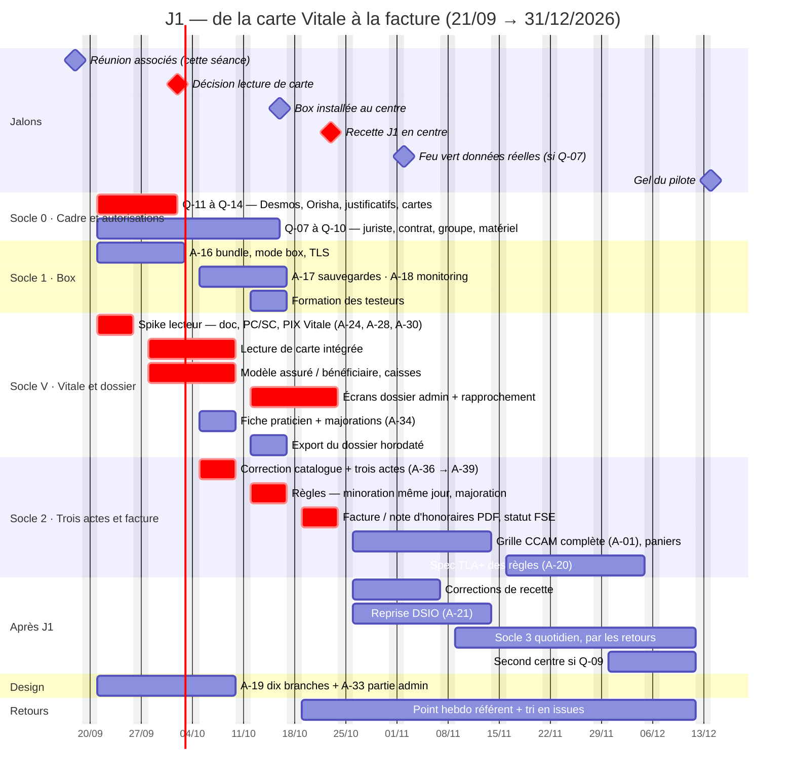
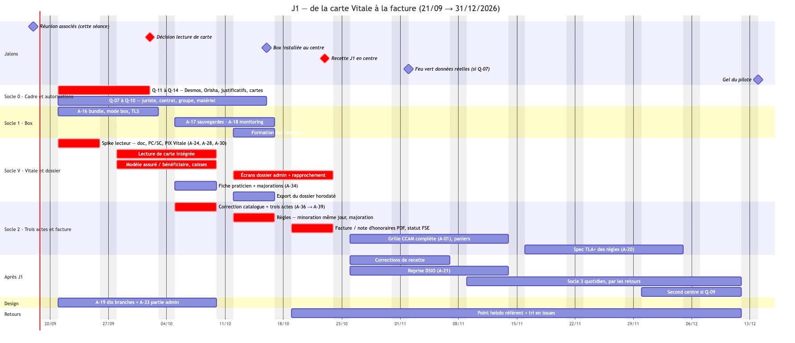

# Atelier 2026-09-18 — Périmètre initial : de la carte Vitale à la facture

- **Participants** : Xavier Barraud, Jean-Paul Jacquot, Abir Talbi
- **Objet** : passer en revue la roadmap du 16/09 et trancher ce qu'on attend vraiment du premier livrable ; en sortir **un jalon précis, court et testable**
- **Transcription** : `docs/ateliers/transcriptions/2026-09-18-perimetre-initial-logiciel-dentaire.txt` (résumé automatique de réunion, local, non versionné)
- **Périmètre** : logiciel Nubiadoc. Société et financement absents de la séance.
- **Séance précédente** : [2026-09-16 — périmètre minimal, réseau local](2026-09-16-perimetre-mvp-reseau-local.md)

## 1. En une phrase

La roadmap du 16/09 partait de la cotation ; les associés ont retourné
l'ordre : **d'abord récupérer un patient et l'ensemble de ses informations,
depuis sa carte Vitale, jusqu'à une facture après validation des droits**, en
local et sans internet, dans un centre réel. Les actes viennent après, sauf
trois (consultation, détartrage haut, détartrage bas) qui servent à prouver
la facturation. Le point dur n'est plus la grille CCAM mais le **lecteur de
cartes** et les autorisations qui vont avec.

## 2. Le jalon J1

> **J1 — « Un patient, de la carte Vitale à la facture, en local »**
> Cible : **vendredi 2026-10-23**, recette en centre.

Recette en sept étapes, sur la box installée dans un centre, **câble réseau
débranché**. Chaque étape est un cas de test ; J1 est atteint quand les sept
passent devant Xavier et Abir sur un vrai jeu de cartes.

| # | Étape | Critère de réussite |
|---|---|---|
| 1 | **Lire la carte Vitale** | Lecteur USB branché, carte du praticien (CPS / CPE) insérée et code porteur saisi, carte Vitale insérée : le logiciel affiche NIR, nom, prénom, date de naissance, régime, caisse, centre, qualité et rang du bénéficiaire, période de droits. Sans internet. |
| 2 | **Créer ou retrouver le dossier** | Patient inconnu → dossier créé pré-rempli depuis la carte. Patient connu (même NIR, ou nom + prénom + naissance) → rapprochement proposé, droits mis à jour, rien n'est dupliqué. |
| 3 | **Compléter le dossier administratif** | Carte mutuelle (organisme, n° adhérent, période, tiers payant), coordonnées, médecin traitant et sa déclaration, correspondants avec coordonnées professionnelles, notes et alertes, rattachement à une famille pour le règlement, questionnaire médical, documents RGPD. Taux AMO / AMC **modifiables à la main**. |
| 4 | **Coter trois actes** | Consultation, détartrage haut, détartrage bas : tarif, base de remboursement, minoration du second détartrage s'il est fait le même jour. Après 20 h ou un dimanche, la majoration est **proposée** et le praticien la confirme ou la retire, selon l'autorisation portée par sa fiche. |
| 5 | **Facturer après validation des droits** | Facture ou note d'honoraires produite (PDF, imprimable) avec parts AMO, AMC, patient. La situation FSE est qualifiée (sécurisée, désynchronisée, non sécurisée, dégradée) mais **rien n'est télétransmis**. |
| 6 | **Exporter le dossier** | Téléchargement du dossier complet, horodatage de chaque information et de chaque acte conservé. |
| 7 | **Administrer** | Fiche praticien : identité, profession, coordonnées, connexion, profil d'accès, autorisation des majorations. Un administrateur voit tout ; le secrétariat ne voit pas le clinique. |

**Repli si le lecteur bloque** (Q-11 à Q-13 non levés au 02/10) : l'étape 1
se fait en saisie manuelle des données de la carte, les étapes 2 à 7 restent
recettées telles quelles. Ce « J1 dégradé » ne vaut pas J1 ; il est noté
comme tel.

**Hors J1**, explicitement : tout autre acte que les trois cités, la
télétransmission (FSE, NOÉMIE, ADRI), la transmission des devis aux mutuelles
(module d'Abir, cf. D-16), tout échange avec le patient (app, rappels), la
synchronisation Doctolib, la reprise de données du logiciel actuel.

## 3. Décisions

| # | Décision | Conséquence |
|---|---|---|
| D-11 | Le **premier jalon** est le dossier patient complet à partir de la carte Vitale, facturé après validation des droits — avant tout travail sur les actes | J1 (§2) remplace le « socle 2 cotation » comme chemin critique ; la roadmap du 16/09 est réordonnée (§5) |
| D-12 | Le périmètre initial se limite aux modules **secrétariat et praticien** ; les échanges avec les patients en sont exclus | Tranche Q-06 : app patient hors MVP. Rappels et canaux sortants (Q-08) sortent du chemin critique |
| D-13 | La cotation démarre par **trois actes** (consultation, détartrage haut, détartrage bas) avec leurs règles ; le reste des actes vient en phase ultérieure | A-01 (grille CCAM complète) n'est plus bloquante pour J1 ; remplacée pour J1 par A-36 (montants des trois actes) |
| D-14 | Les tests se font **en local, sans connexion internet**, dans un centre réel, avec de vrais lecteurs et de vraies cartes | Confirme D-05 / D-06 ; la box (A-16) est le support de la recette J1 |
| D-15 | Les majorations nuit (après 20 h) et dimanche sont **détectées automatiquement, jamais appliquées d'office** : le praticien confirme ou retire, selon un paramètre d'autorisation de sa fiche | Nouveau champ fiche praticien (A-34) + règle dans le moteur de cotation |
| D-16 | La **lecture de la carte mutuelle pour les devis** est distincte de la création du dossier ; le module de prise en charge d'Abir n'est pas exploitable en l'état et sera retravaillé avant tout usage | Socle 4 « argent » repoussé après le pilote ; Q-04 reste ouverte mais ne bloque plus rien avant 2027 |
| D-17 | Les données de mutuelle sont **renseignées automatiquement** quand c'est possible, avec correction manuelle toujours possible ; idem pour les taux AMO / AMC | Contrainte de conception sur l'écran couverture (étape 3 de J1) |
| D-18 | **Vizia** (Visy) est la référence fonctionnelle ; Desmos la référence d'ouverture aux intégrations | Les écrans de J1 se comparent à Vizia, pas à Dental Pilot (`docs/17`) |

## 4. Arbitrages ouverts

| # | Question | Bloque | Porteur |
|---|---|---|---|
| Q-11 | **À quelles conditions peut-on lire une carte Vitale** sans agrément SESAM-Vitale : carte professionnelle + code porteur suffisent-ils, quels justificatifs administratifs, quel statut pour Nubia ? | Étape 1 de J1 | Équipe (Abir pour les justificatifs, Jean-Paul pour la technique) |
| Q-12 | **PIX Vitale** (Desmos) : payant ? autorisé pour des essais ? exploitable comme source de données ou comme référence de format seulement ? | Étape 1 de J1, choix de la pile de lecture | Abir → Desmos |
| Q-13 | **Orisha** (ou prestataire similaire) doit-il intervenir pour la facturation ou la connexion technique ? À quelles conditions accède-t-on aux éléments techniques ? Rejoue Q-01, dont `docs/15` excluait Orisha comme concurrent | Étape 5 de J1 au-delà du papier ; lot 7 | Abir → Guillaume |
| Q-14 | **Cartes utilisées pour la recette** : jeu de cartes de test du GIE SESAM-Vitale, ou cartes réelles des testeurs ? Une carte réelle est une donnée réelle (Q-07) | Recette J1 | Xavier |

Q-01 à Q-05, Q-07 à Q-10 restent ouvertes. Q-06 est tranchée par D-12.

## 5. Demandes métier → état de l'existant

Vérifié dans le code au 2026-09-18 (migrations `db/migrations`, modules
`api/src`, écrans `front/apps`).

| Demande | État | Existant / manque |
|---|---|---|
| Lecture carte Vitale + carte praticien, code porteur | ⛔ | Rien : aucun accès lecteur (PC/SC), aucune notion de carte dans l'API. « Carte Vitale » n'apparaît que comme rappel « à apporter » (`appointments_preparation.rs`) |
| Données d'assuré / bénéficiaire (NIR, qualité, rang, caisse, centre, période de droits) | ⛔ | `patient_account` porte un INS chiffré, nom, prénom, naissance, contact. Pas de NIR, pas d'assuré distinct du bénéficiaire, pas de caisse ni de centre. `patient_coverage.regime_obligatoire` limité à `regime_general` / `ame` / `css` |
| Référentiel des caisses et centres par régime | ⛔ | Absent. Attend le fichier de A-32 |
| Mutuelle : organisme, n° adhérent, période, tiers payant | ✅ | `patient_coverage` (0023, 0174) + `mutuelle_referentiel` (0187, 0188). Manque : auto-renseignement (D-17), taux |
| Taux AMO / AMC modifiables | 🟠 | Parts estimées à 70 % puis corrigées à la main sur le devis (`cabinet_quote_item_parts.rs`). Pas de taux au niveau du patient ni de la couverture |
| Validation des droits (ADRI) | ⛔ | Hors J1 (télétransmission) |
| Identité et coordonnées, création rapide | ✅ | `patient_account`, `patient_quick_create_page.dart` (nom, prénom, naissance, téléphone) |
| Rapprochement / doublons | ✅ | `patient_merge_candidates.rs`, `patient_merge.rs`, fonction `merge_patient` (0178, 0217). À étendre au NIR |
| Médecin traitant | 🟠 | `patient_referring_doctor` (0129). Pas de « déclaration de médecin traitant » |
| Correspondants médicaux | ✅ | `patient_correspondent` (0176), rôle + praticien référencé ou libre |
| Rattachement famille pour le règlement | 🟠 | `account_guardianship` (0025) = tuteur / enfant seulement. Pas de « famille » de règlement |
| Notes et alertes | ✅ | `clinical_note`, `patient_alerts.rs`, `patient_tag` (0158) |
| Questionnaire médical, documents RGPD | ✅ | `medical_record` chiffré, `consent_record` (0048), `documents.rs` |
| Fiche praticien : identité, profession, coordonnées, connexion, profil d'accès | 🟠 | `practitioner` (RPPS, spécialité, `conventions` OPTAM), `app_user` (ADELI, MFA), `cabinet_membership` (rôle admin / praticien / secrétaire / assistant + permissions). L'écran `admin_membres` ne saisit que nom, prénom, e-mail, rôle. Pas de profession, pas de coordonnées |
| Autorisation des majorations nuit / dimanche | ⛔ | Rien dans le modèle ni le moteur |
| Acte de consultation, tarif, base de remboursement | 🟠 | Catalogue NGAP (0159) : `DC` à 23 €. Base de remboursement = `secteur1_cents` / `optam_cents` sur le CCAM (0161), pas sur le NGAP |
| Détartrage haut / bas et minoration même jour | ⛔ | Catalogue CCAM (0119) : `HBGD036` « deux arcades » et `HBGD017` ; `HBJD001` y est libellé « obturation » alors que c'est le code du détartrage dans la CCAM officielle — **catalogue à corriger avant de paramétrer**. Aucune règle d'association / minoration (le moteur `consultation_act_create.rs` ne connaît que bundles et incompatibilités) |
| Paramétrer des actes depuis l'application | ⛔ | L'écriture du catalogue est **révoquée à l'application** (0197). Créer un acte = migration ou seed, pas un écran. Les actions A-37 à A-39 passent donc par Jean-Paul |
| Facture / note d'honoraires | 🟠 | Devis avec parts AMO / AMC (`billing.rs`), `consultations.rs` crée un devis « facturable » à partir des actes, encaissement manuel (0164). Pas de document « facture » ni de note d'honoraires, pas de numérotation |
| Statuts FSE | ⛔ | Aucune notion de FSE (`docs/15` §2) |
| Export du dossier patient horodaté | ⛔ | Seul `cabinet_quotes_export.rs` existe. Horodatage : `created_at` partout, `audit_log` append-only |
| Lisibilité de la partie administrative (contraste, notes) | 🟠 | Dix branches `agent/design-ecran-*` non mergées (A-19) |
| Synchronisation Doctolib des RDV | 🟠 | Chantier interop HL7v2 / FHIR : `api/src/hl7v2`, branches poussées non mergées. Hors J1 |
| Test local sans internet | 🟠 | `infra/deploy` ; mode « box » en cours (A-16) |

## 6. Ce que ça change dans la roadmap

La roadmap du 16/09 reste le cadre (box, cadre juridique, retours). Trois
choses changent :

1. **Nouveau chemin critique : « Vitale → dossier → facture »** (J1), à la
   place de la cotation CCAM générale. Le socle 2 est réduit à trois actes et
   à leurs règles ; la grille complète (A-01) et la spec TLA+ du moteur
   (A-20) viennent après J1.
2. **Le socle 0 s'étend aux autorisations de lecture de carte** (Q-11 à
   Q-13). C'est le second chemin critique : sans réponse au 02/10, J1 se
   recette en mode dégradé.
3. **Sortent du chemin avant fin d'année** : le socle 4 « argent » (module
   d'Abir à retravailler, D-16), la reprise de données DSIO (A-21, plus
   nécessaire pour J1 : le patient vient de sa carte), les rappels et l'app
   patient (D-12). Le socle 3 « quotidien » démarre après J1, piloté par les
   retours.

### Socle 0 — Cadre du pilote et autorisations · semaines 1-2

- Q-07 / Q-08 / Q-09 inchangés (juriste, contrat de pilote, structure du groupe).
- **Ajout** : Q-11 à Q-14. Retour de Desmos (PIX Vitale), retour de
  Guillaume (Orisha), liste des justificatifs, choix des cartes de recette.
- Point de décision **02/10 : lecture de carte « go » ou « J1 dégradé »**.

### Socle 1 — La box · semaines 1-4 · inchangé, allégé

A-16, A-17, A-18 tels quels : c'est le support de la recette J1. La reprise
de données DSIO (A-21) sort du socle et passe **après J1** ; la box du centre
démarre vide et se remplit par les cartes.

### Socle V — Carte Vitale et dossier patient · semaines 1-4 · chemin critique

Nouveau. Existant ~40 % (identité, mutuelle, correspondants, notes,
questionnaire, RGPD sont là ; tout ce qui vient de la carte manque).

- **Semaine 1, spike lecteur** : doc du lecteur, test PC/SC avec CPS + Vitale
  en simultané, code porteur, fichiers PIX Vitale ; livrable = note de
  faisabilité (A-24) et décision du 02/10.
- Modèle : assuré / bénéficiaire, NIR, régime, caisse, centre, période de
  droits ; référentiel caisses (A-32) ; déclaration médecin traitant ;
  famille de règlement ; taux AMO / AMC au niveau couverture.
- Écrans secrétariat : « lire la carte » → dossier pré-rempli ou
  rapprochement ; fiche administrative complète ; contraste et notes (A-33).
- Fiche praticien complète + autorisation des majorations (A-34).
- Export du dossier horodaté.

### Socle 2 — Trois actes et une facture · semaines 3-5

- Corriger le catalogue (libellés `HBJD*`), poser consultation, détartrage
  haut, détartrage bas avec tarif et base de remboursement (montants de A-36).
- Règles : minoration second détartrage même jour ; majoration nuit /
  dimanche proposée sous autorisation (D-15).
- Document facture / note d'honoraires PDF, parts AMO / AMC / patient,
  qualification du statut FSE sans télétransmission.
- Après J1 : grille CCAM complète (A-01), `panier_sante`, plafonds, spec TLA+
  (A-20) — le moteur aura déjà ses trois règles vérifiables, bon point de
  départ pour la première spec.

### Socle 3 — Quotidien · après J1, semaines 6-12

Contenu du 16/09 inchangé (CR de RDV, salle d'attente, check-list, to-do,
tableau de bord). L'ordre sera dicté par les retours de la recette J1.

### Socle 4 — Argent · repoussé après le pilote

Acompte et refus motivé restent possibles en fin d'année si le socle 3 le
permet. Le module de prise en charge d'Abir attend sa refonte (D-16).

### Socle 5 — Design · avant la recette J1

A-19 (dix branches) + A-33 (partie administrative). À merger avant le 16/10.

### Socle 6 — Retours · dès la recette J1

Inchangé. Le point hebdomadaire avec le référent démarre la semaine du 19/10.

### Calendrier

| Semaines | Dates | Jalons |
|---|---|---|
| 1 | 21/09 – 25/09 | Parcours patient reçu (A-23, 20/09) · test de lecture de Xavier (21/09) · lecteurs et cartes disponibles · note de faisabilité (A-24) |
| 2 | 28/09 – 02/10 | Box v1 chez Nubia (A-16) · **02/10 : décision lecture de carte** (Q-11 à Q-13) |
| 3-4 | 05/10 – 16/10 | Dossier patient complet, fiche praticien, référentiel caisses · trois actes et règles · design mergé · **box installée au centre (16/10)** |
| 5 | 19/10 – 23/10 | Facture PDF, export · **recette J1 en centre, vendredi 23/10** |
| 6-8 | 26/10 – 13/11 | Corrections de recette · grille CCAM complète (A-01) · reprise DSIO (A-21) · bascule données réelles si Q-07 vert |
| 9-12 | 16/11 – 11/12 | Socle 3 par les retours · spec TLA+ des règles de cotation · second centre si Q-09 |
| 13-15 | 14/12 – 31/12 | Gel, bilan, formations de janvier |

### Gantt

Jours ouvrés, week-ends exclus. En rouge, les deux chemins critiques :
autorisations de lecture de carte, et Vitale → dossier → facture.

### Ce qu'on ne promet pas

La liste du 16/09 tient (SESAM-Vitale, Ségur, cloud HDS, app patient à
distance, LLM local, multi-site). S'y ajoute pour fin d'année : la reprise du
module de prise en charge d'Abir, et tout acte au-delà de la grille CCAM
importée.

## 7. Actions

Les actions du 16/09 (A-12 à A-22) sont revues dans le
[README](README.md#actions-ouvertes) : A-12 close, A-01 et A-20 passent après
J1, A-21 repoussée. Les tâches issues de cette séance :

| # | Action | Porteur | Échéance |
|---|---|---|---|
| A-23 | Décrire le parcours patient étape par étape, de la carte Vitale à la facture | Abir | 2026-09-20 |
| A-24 | Évaluer la faisabilité du flux complet à partir de A-23 ; note écrite | Jean-Paul | 2026-09-25 |
| A-25 | Mettre à disposition des lecteurs de cartes pour les essais | Xavier | 2026-09-25 |
| A-26 | Fournir une carte de centre (carte professionnelle de la structure) pour les tests | Abir | 2026-09-25 |
| A-27 | Demander à Desmos si PIX Vitale est payant et autorisé pour les essais (Q-12) | Abir | 2026-09-25 |
| A-28 | Étudier la doc du lecteur, tester la lecture PC/SC avec carte praticien et carte Vitale en simultané, code porteur ; intégrer les données lues | Jean-Paul | 2026-10-02 |
| A-29 | Test de lecture avec une carte Vitale et une seconde carte d'authentification | Xavier | 2026-09-21 |
| A-30 | Examiner les fichiers PIX Vitale et tester leur exploitation | Jean-Paul | 2026-10-02 |
| A-31 | Transmettre les fichiers et la configuration PIX Vitale d'un poste de centre | Xavier | 2026-09-25 |
| A-32 | Trouver le fichier des numéros de caisse et de centre par régime obligatoire | Xavier | 2026-10-02 |
| A-33 | Lisibilité de la partie administrative : contraste, affichage des notes | Xavier | 2026-10-09 |
| A-34 | Fiche praticien : paramètre « autorisé à facturer les majorations après 20 h et le dimanche » | Xavier | 2026-10-09 |
| A-35 | Tester la gestion du dossier patient une fois implémentée | Équipe | 2026-10-16 |
| A-36 | Fournir les montants de la consultation et des détartrages (tarif, base de remboursement, minoration) | Abir | 2026-10-02 |
| A-37 | Créer l'acte de consultation avec tarif et base de remboursement | Xavier (Jean-Paul pour le seed, cf. §5) | 2026-10-09 |
| A-38 | Créer le détartrage haut avec ses règles de remboursement | Xavier (idem) | 2026-10-09 |
| A-39 | Créer le détartrage bas avec ses règles et la minoration même jour | Xavier (idem) | 2026-10-09 |
| A-40 | Configurer la création complète de la fiche patient pour les tests fonctionnels | Xavier | 2026-10-16 |
| A-41 | Vérifier les conditions d'autorisation et les justificatifs pour accéder aux données de la carte Vitale (Q-11) | Équipe | 2026-10-02 |
| A-42 | Retour de Guillaume sur l'intervention d'Orisha et l'accès aux éléments techniques (Q-13) | Abir | 2026-10-02 |

## 8. Points de vigilance

**Le lecteur est le seul inconnu technique, et il est double.** Côté
protocole, PC/SC et la structure de la carte Vitale sont documentés ; côté
droit, lire une carte Vitale hors d'un logiciel agréé n'est pas anodin
(Q-11). Le spike de la semaine 1 doit répondre aux deux, pas seulement au
premier. Sans réponse le 02/10, on recette J1 en saisie manuelle et on le dit.

**Cartes réelles = données réelles.** La carte Vitale de Xavier lue sur la
box est une donnée de santé réelle, avant que Q-07 soit tranchée. Préférer un
jeu de cartes de test (Q-14) ; à défaut, ne lire que les cartes des
testeurs, avec leur accord écrit, sur une box qui n'a jamais quitté Nubia.

**Orisha contredit `docs/15`.** La décision de juillet excluait Sephira /
Orisha comme concurrent direct ; la séance l'envisage comme prestataire de
connexion. Si Q-13 confirme cette piste, `docs/15` doit être rejouée (A-11),
pas contournée.

**Le catalogue CCAM contient des libellés faux** (`HBJD001` à `HBJD003`,
§5). Les tests de cotation du dépôt s'appuient dessus. À corriger par
migration avec les codes officiels avant de paramétrer les détartrages, sinon
la recette J1 valide de mauvais codes.

**Les actions « Xavier crée l'acte » sont des actions de développement.**
L'application ne peut pas écrire dans le catalogue (0197). Soit un écran de
paramétrage est ajouté (hors J1), soit Jean-Paul pose les trois actes par
seed avec les montants d'Abir. La seconde option est retenue pour J1.
